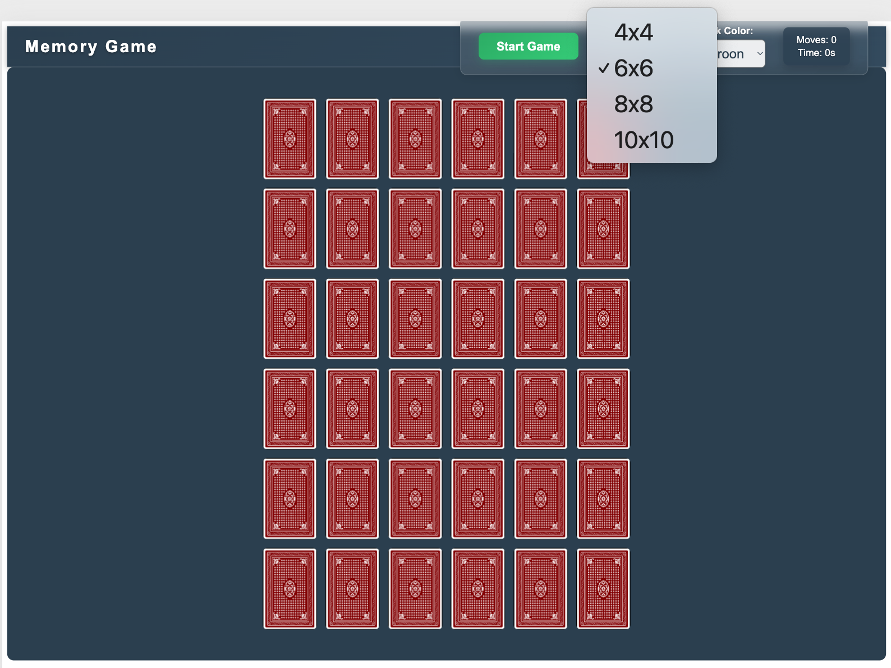
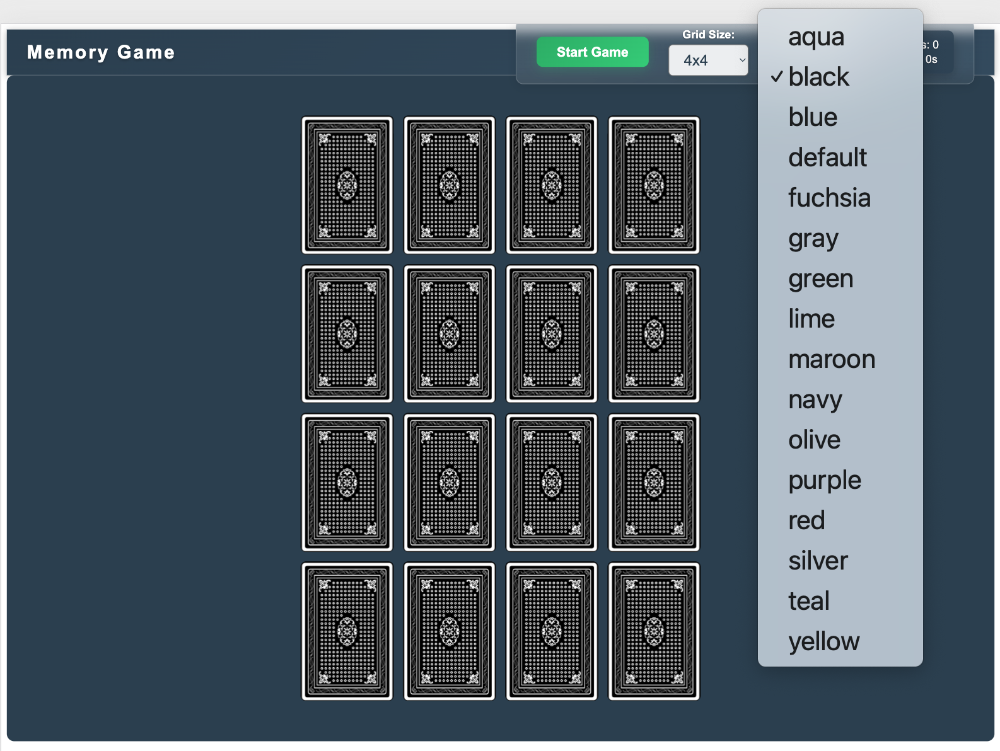
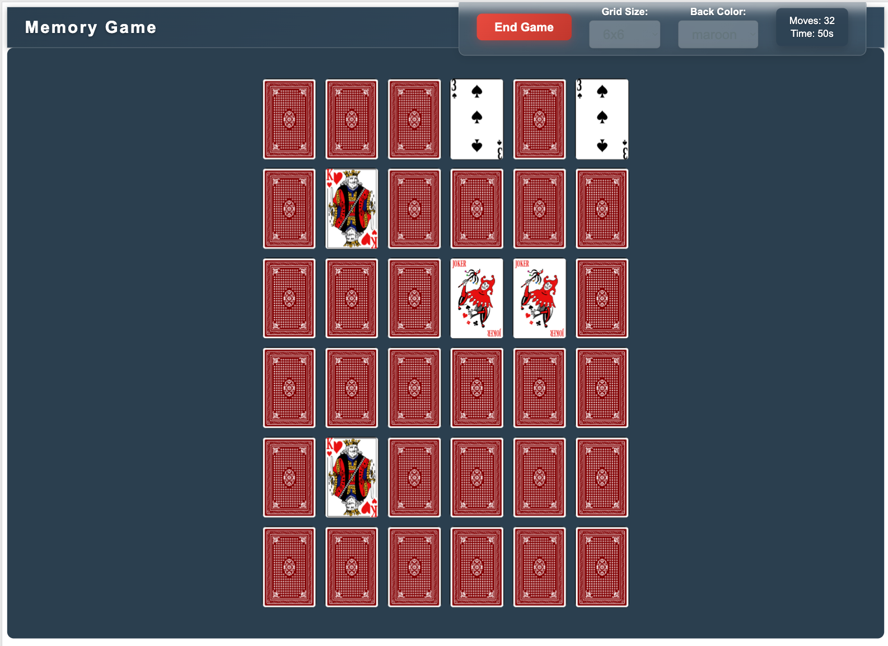
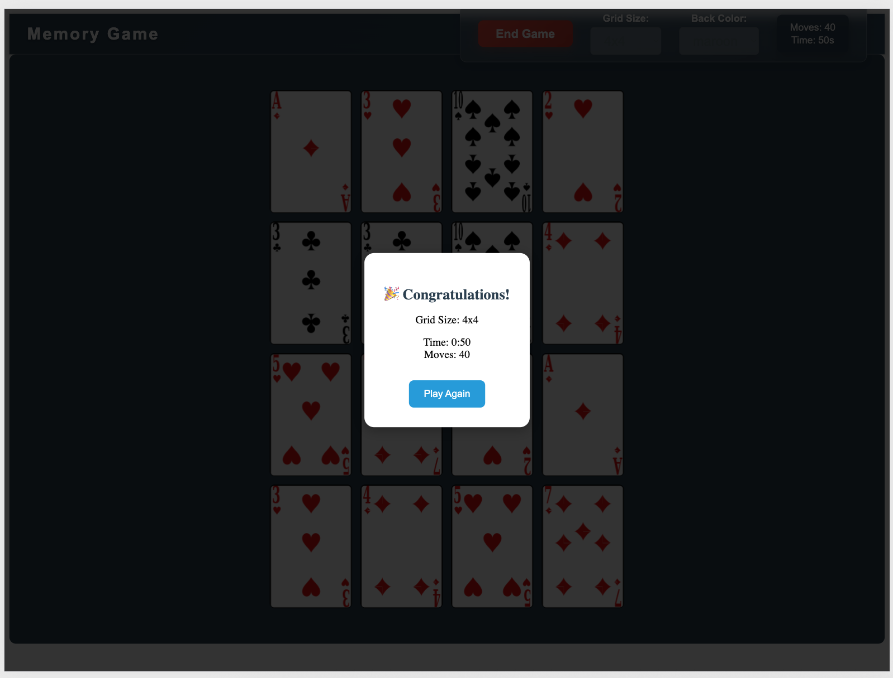

# Memory Game

A classic card-matching memory game built with React, featuring responsive design, customizable grid sizes, and various card back colors.


## 🎮 Features

- **Responsive Design**: Built with `vh`/`vw` units for perfect scaling across all devices
- **Customizable Grid Sizes**: Choose from 4x4, 6x6, 8x8, or 10x10 grids
- **Card Back Colors**: 16 different color options for personalization
- **Real-time Statistics**: Track your moves and time
- **Game Completion Modal**: Celebrate your victories with detailed stats
- **Modern UI**: Glass-morphism design with smooth animations

## 🚀 Live Demo

[Play the Memory Game](https://lyn-kodehode.github.io/React-memory-game/)

## 📸 Screenshots

### Game Setup




_Choose your grid size and card back color before starting_

### Game in Progress (6x6 Grid)


_6x6 grid with maroon card backs - perfect for a challenging game_

### Game Completion


_Celebrate your victory with detailed statistics_

## 🛠️ Technologies Used

- **React 18** - Modern React with hooks
- **Vite** - Fast build tool and development server
- **CSS Modules** - Scoped styling
- **Context API** - Global state management
- **CSS 3D Transforms** - Card flip animations
- **Responsive Design** - `vh`/`vw` units for fluid layouts

## 🎯 How to Play

1. **Choose Settings**: Select your preferred grid size (4x4 to 10x10) and card back color
2. **Start Game**: Click "Start Game" to begin the timer
3. **Find Matches**: Click cards to flip them and find matching pairs
4. **Complete the Game**: Match all pairs to win!
5. **View Stats**: See your final time, moves, and grid size

## 🚀 Getting Started

### Prerequisites

- Node.js (version 14 or higher)
- npm or yarn

### Installation

1. **Clone the repository**

   ```bash
   git clone https://github.com/your-username/react-memory-game.git
   cd react-memory-game
   ```

2. **Install dependencies**

   ```bash
   npm install
   ```

3. **Start development server**

   ```bash
   npm run dev
   ```

4. **Open your browser**
   Navigate to `http://localhost:5173`

## 🏗️ Build and Deploy

### Build for Production

```bash
npm run build
```

### Deploy to GitHub Pages

```bash
npm run deploy
```

## 🎨 Customization

### Adding New Card Backs

1. Add new `.png` files to `src/assets/cards/back/`
2. Follow the naming convention: `back-[colorname].png`
3. The game will automatically detect and include them

### Modifying Grid Sizes

Edit the `gridSizes` array in `src/components/Controls.jsx`:

```javascript
const gridSizes = [4, 6, 8, 10, 12]; // Add 12x12 for extra challenge
```

## 🏆 Game Features

- **Smart Card Flipping**: 3D CSS animations with perspective
- **Match Detection**: Automatic pair recognition
- **Timer System**: Precise timing with start/stop controls
- **Move Counter**: Track your efficiency
- **Game States**: Proper start/end/reset functionality
- **Responsive Cards**: Dynamic sizing based on grid and viewport

## 🎮 Game Rules

1. **Objective**: Find all matching pairs of cards
2. **Gameplay**: Click two cards to flip them
3. **Matching**: If cards match, they stay flipped
4. **No Match**: Cards flip back after a delay
5. **Victory**: Match all pairs to complete the game

### Project Structure

```markdown
src/
├── components/
│ ├── BoardComponent.jsx
│ ├── CardComponent.jsx
│ ├── Controls.jsx
│ ├── GameCompletion.jsx
│ └── HeaderComponent.jsx
├── context/
│ └── AppContext.jsx
├── styles/
├── utils/
└── assets/
```

### Key Features Implementation

- **Context API**: Global state for game logic
- **CSS Modules**: Scoped component styling
- **Dynamic Imports**: Automatic card image loading
- **Responsive Design**: Viewport-based sizing

## 📱 Browser Support

- Chrome (recommended)
- Firefox
- Safari
- Edge

## 🤝 Contributing

1. Fork the repository
2. Create a feature branch (`git checkout -b feature/amazing-feature`)
3. Commit your changes (`git commit -m 'Add amazing feature'`)
4. Push to the branch (`git push origin feature/amazing-feature`)
5. Open a Pull Request

## 🙏 Acknowledgments

- **Kodehode/Jobloop** for the Coding Bootcamp
- React documentation for best practices
- Vite team for the amazing build tool

---

**Enjoy playing the Memory Game!** 🎮✨
